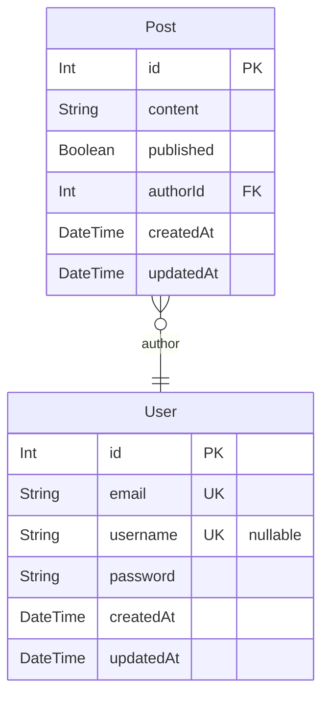

# authentication
> Generated by [`prisma-markdown`](https://github.com/samchon/prisma-markdown)

- [default](#default)

## default

### `User`

**Properties**
  - `id`: 
  - `email`: 
  - `username`: 
  - `password`: 
  - `createdAt`: 
  - `updatedAt`: 

### `Post`

**Properties**
  - `id`: 
  - `content`: 
  - `published`: 
  - `authorId`: 
  - `createdAt`: 
  - `updatedAt`: 