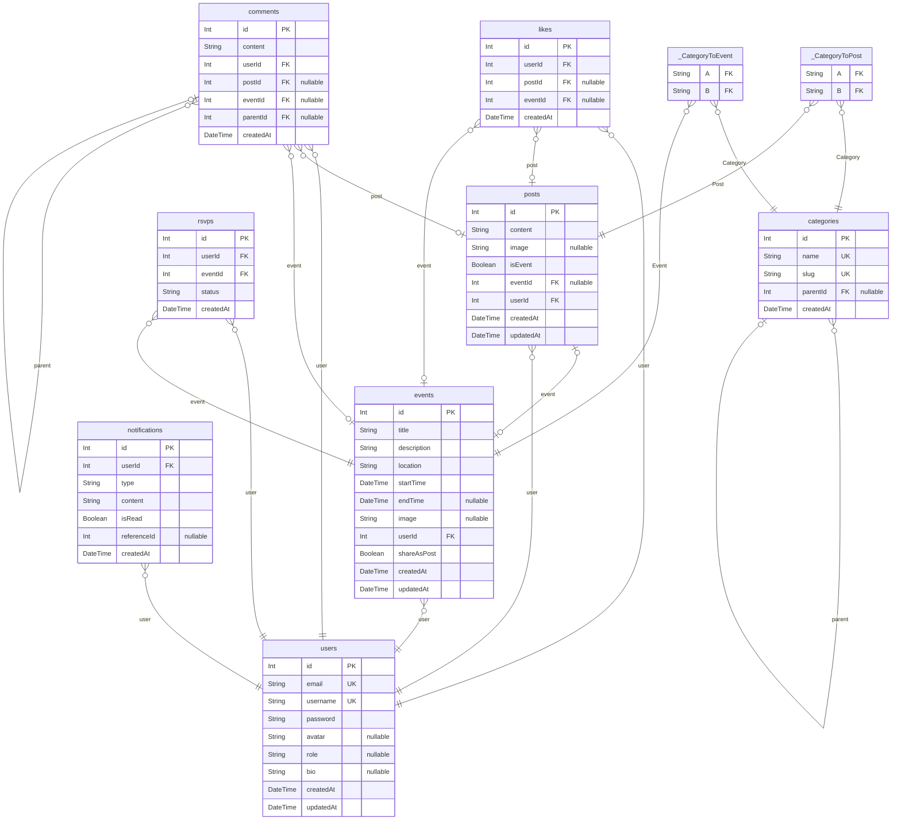

# authentication
> Generated by [`prisma-markdown`](https://github.com/samchon/prisma-markdown)

- [default](#default)

## default

### `users`

**Properties**
  - `id`: 
  - `email`: 
  - `username`: 
  - `password`: 
  - `avatar`: 
  - `role`: 
  - `bio`: 
  - `createdAt`: 
  - `updatedAt`: 

### `categories`

**Properties**
  - `id`: 
  - `name`: 
  - `slug`: 
  - `parentId`: 
  - `createdAt`: 

### `posts`

**Properties**
  - `id`: 
  - `content`: 
  - `image`: 
  - `isEvent`: 
  - `eventId`: 
  - `userId`: 
  - `createdAt`: 
  - `updatedAt`: 

### `events`

**Properties**
  - `id`: 
  - `title`: 
  - `description`: 
  - `location`: 
  - `startTime`: 
  - `endTime`: 
  - `image`: 
  - `userId`: 
  - `shareAsPost`: 
  - `createdAt`: 
  - `updatedAt`: 

### `comments`

**Properties**
  - `id`: 
  - `content`: 
  - `userId`: 
  - `postId`: 
  - `eventId`: 
  - `parentId`: 
  - `createdAt`: 

### `likes`

**Properties**
  - `id`: 
  - `userId`: 
  - `postId`: 
  - `eventId`: 
  - `createdAt`: 

### `rsvps`

**Properties**
  - `id`: 
  - `userId`: 
  - `eventId`: 
  - `status`: 
  - `createdAt`: 

### `notifications`

**Properties**
  - `id`: 
  - `userId`: 
  - `type`: 
  - `content`: 
  - `isRead`: 
  - `referenceId`: 
  - `createdAt`: 

### `_CategoryToPost`
Pair relationship table between [categories](#categories) and [posts](#posts)

**Properties**
  - `A`: 
  - `B`: 

### `_CategoryToEvent`
Pair relationship table between [categories](#categories) and [events](#events)

**Properties**
  - `A`: 
  - `B`: 