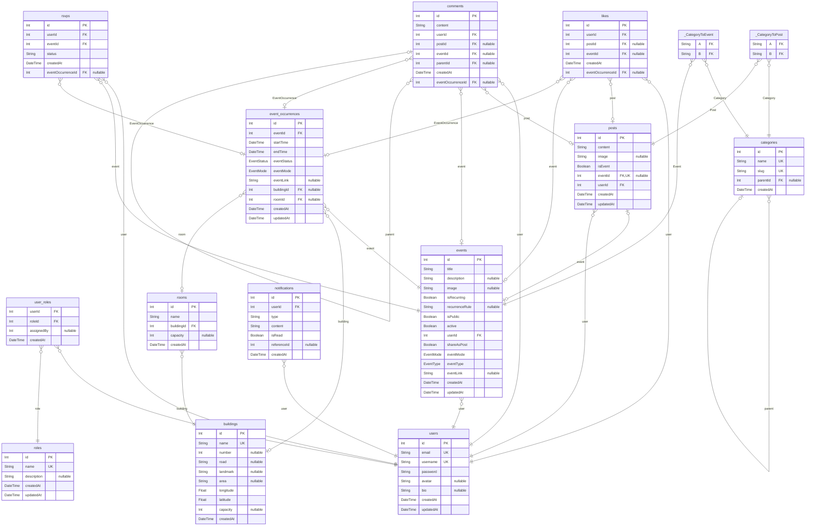

# authentication
> Generated by [`prisma-markdown`](https://github.com/samchon/prisma-markdown)

- [default](#default)

## default

```mermaid
erDiagram
"users" {
  Int id PK
  String email UK
  String username UK
  String password
  String avatar "nullable"
  String bio "nullable"
  DateTime createdAt
  DateTime updatedAt
}
"roles" {
  Int id PK
  String name UK
  String description "nullable"
  DateTime createdAt
  DateTime updatedAt
}
"user_roles" {
  Int userId FK
  Int roleId FK
  Int assignedBy "nullable"
  DateTime createdAt
}
"categories" {
  Int id PK
  String name UK
  String slug UK
  Int parentId FK "nullable"
  DateTime createdAt
}
"posts" {
  Int id PK
  String content
  String image "nullable"
  Boolean isEvent
  Int eventId FK,UK "nullable"
  Int userId FK
  DateTime createdAt
  DateTime updatedAt
}
"events" {
  Int id PK
  String title
  String description "nullable"
  String image "nullable"
  Boolean isRecurring
  String recurrenceRule "nullable"
  Boolean isPublic
  Boolean active
  Int userId FK
  Boolean shareAsPost
  EventMode eventMode
  EventType eventType
  String eventLink "nullable"
  DateTime createdAt
  DateTime updatedAt
}
"event_occurrences" {
  Int id PK
  Int eventId FK
  DateTime startTime
  DateTime endTime
  EventStatus eventStatus
  EventMode eventMode
  String eventLink "nullable"
  Int buildingId FK "nullable"
  Int roomId FK "nullable"
  DateTime createdAt
  DateTime updatedAt
}
"buildings" {
  Int id PK
  String name UK
  Int number "nullable"
  String road "nullable"
  String landmark "nullable"
  String area "nullable"
  Float longitude
  Float latitude
  Int capacity "nullable"
  DateTime createdAt
}
"rooms" {
  Int id PK
  String name
  Int buildingId FK
  Int capacity "nullable"
  DateTime createdAt
}
"comments" {
  Int id PK
  String content
  Int userId FK
  Int postId FK "nullable"
  Int eventId FK "nullable"
  Int parentId FK "nullable"
  DateTime createdAt
  Int eventOccurrenceId FK "nullable"
}
"likes" {
  Int id PK
  Int userId FK
  Int postId FK "nullable"
  Int eventId FK "nullable"
  DateTime createdAt
  Int eventOccurrenceId FK "nullable"
}
"rsvps" {
  Int id PK
  Int userId FK
  Int eventId FK
  String status
  DateTime createdAt
  Int eventOccurrenceId FK "nullable"
}
"notifications" {
  Int id PK
  Int userId FK
  String type
  String content
  Boolean isRead
  Int referenceId "nullable"
  DateTime createdAt
}
"_CategoryToPost" {
  String A FK
  String B FK
}
"_CategoryToEvent" {
  String A FK
  String B FK
}
"user_roles" }o--|| "users" : user
"user_roles" }o--|| "roles" : role
"categories" }o--o| "categories" : parent
"posts" |o--o| "events" : event
"posts" }o--|| "users" : user
"events" }o--|| "users" : user
"event_occurrences" }o--|| "events" : event
"event_occurrences" }o--o| "buildings" : building
"event_occurrences" }o--o| "rooms" : room
"rooms" }o--|| "buildings" : building
"comments" }o--|| "users" : user
"comments" }o--o| "posts" : post
"comments" }o--o| "events" : event
"comments" }o--o| "comments" : parent
"comments" }o--o| "event_occurrences" : EventOccurrence
"likes" }o--|| "users" : user
"likes" }o--o| "posts" : post
"likes" }o--o| "events" : event
"likes" }o--o| "event_occurrences" : EventOccurrence
"rsvps" }o--|| "users" : user
"rsvps" }o--|| "events" : event
"rsvps" }o--o| "event_occurrences" : EventOccurrence
"notifications" }o--|| "users" : user
"_CategoryToPost" }o--|| "categories" : Category
"_CategoryToPost" }o--|| "posts" : Post
"_CategoryToEvent" }o--|| "categories" : Category
"_CategoryToEvent" }o--|| "events" : Event
```

### `users`

**Properties**
  - `id`: 
  - `email`: 
  - `username`: 
  - `password`: 
  - `avatar`: 
  - `bio`: 
  - `createdAt`: 
  - `updatedAt`: 

### `roles`

**Properties**
  - `id`: 
  - `name`: 
  - `description`: 
  - `createdAt`: 
  - `updatedAt`: 

### `user_roles`

**Properties**
  - `userId`: 
  - `roleId`: 
  - `assignedBy`: 
  - `createdAt`: 

### `categories`

**Properties**
  - `id`: 
  - `name`: 
  - `slug`: 
  - `parentId`: 
  - `createdAt`: 

### `posts`

**Properties**
  - `id`: 
  - `content`: 
  - `image`: 
  - `isEvent`: 
  - `eventId`: 
  - `userId`: 
  - `createdAt`: 
  - `updatedAt`: 

### `events`

**Properties**
  - `id`: 
  - `title`: 
  - `description`: 
  - `image`: 
  - `isRecurring`: 
  - `recurrenceRule`: 
  - `isPublic`: 
  - `active`: 
  - `userId`: 
  - `shareAsPost`: 
  - `eventMode`: 
  - `eventType`: 
  - `eventLink`: 
  - `createdAt`: 
  - `updatedAt`: 

### `event_occurrences`

**Properties**
  - `id`: 
  - `eventId`: 
  - `startTime`: 
  - `endTime`: 
  - `eventStatus`: 
  - `eventMode`: 
  - `eventLink`: 
  - `buildingId`: 
  - `roomId`: 
  - `createdAt`: 
  - `updatedAt`: 

### `buildings`

**Properties**
  - `id`: 
  - `name`: 
  - `number`: 
  - `road`: 
  - `landmark`: 
  - `area`: 
  - `longitude`: 
  - `latitude`: 
  - `capacity`: 
  - `createdAt`: 

### `rooms`

**Properties**
  - `id`: 
  - `name`: 
  - `buildingId`: 
  - `capacity`: 
  - `createdAt`: 

### `comments`

**Properties**
  - `id`: 
  - `content`: 
  - `userId`: 
  - `postId`: 
  - `eventId`: 
  - `parentId`: 
  - `createdAt`: 
  - `eventOccurrenceId`: 

### `likes`

**Properties**
  - `id`: 
  - `userId`: 
  - `postId`: 
  - `eventId`: 
  - `createdAt`: 
  - `eventOccurrenceId`: 

### `rsvps`

**Properties**
  - `id`: 
  - `userId`: 
  - `eventId`: 
  - `status`: 
  - `createdAt`: 
  - `eventOccurrenceId`: 

### `notifications`

**Properties**
  - `id`: 
  - `userId`: 
  - `type`: 
  - `content`: 
  - `isRead`: 
  - `referenceId`: 
  - `createdAt`: 

### `_CategoryToPost`
Pair relationship table between [categories](#categories) and [posts](#posts)

**Properties**
  - `A`: 
  - `B`: 

### `_CategoryToEvent`
Pair relationship table between [categories](#categories) and [events](#events)

**Properties**
  - `A`: 
  - `B`: 